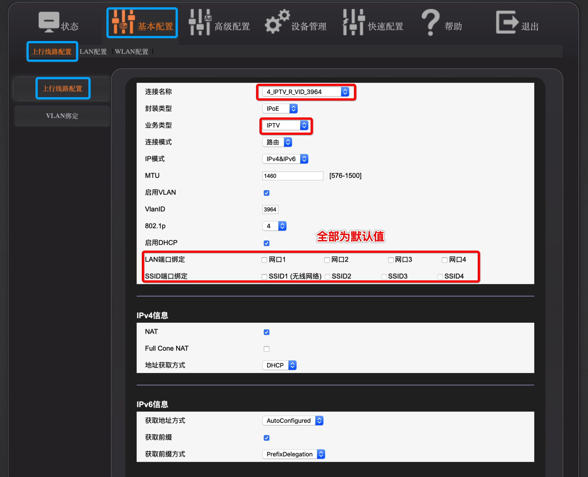
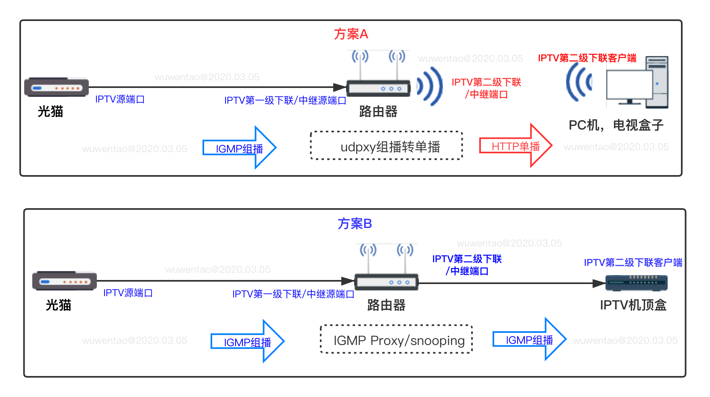
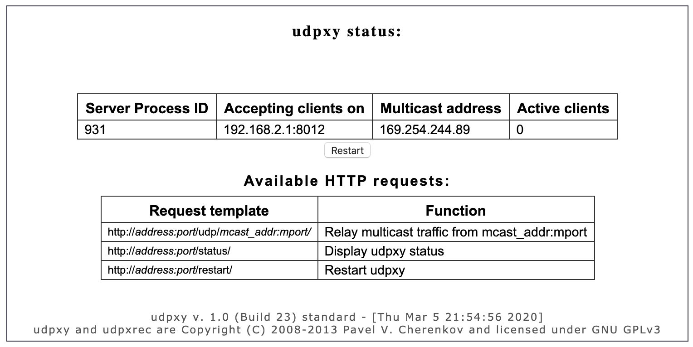
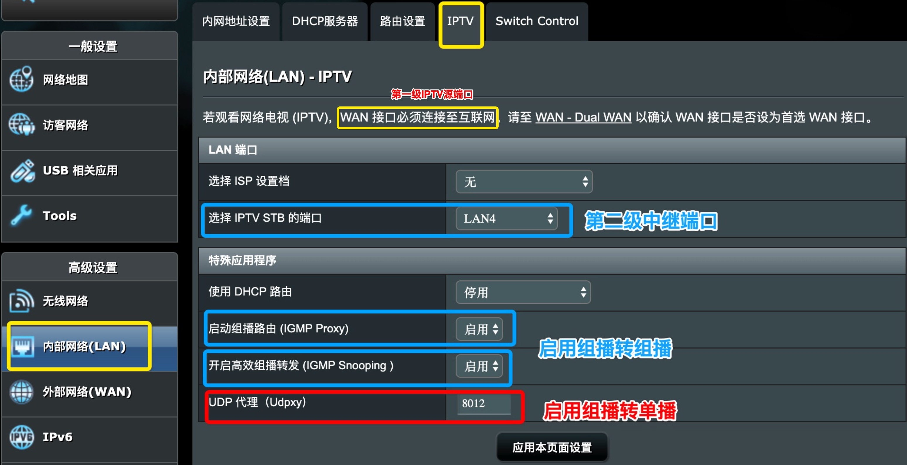

# 1. IPTV中继原理

## 1.1 光猫管理员权限的意义和作用

- 正常来说，**光猫只需使用IPTV默认值即可，无需任何修改即可下级中继, 也无需光猫获取管理员权限**
- 光猫获取管理员权限的目的和意义：
    - 将Internet端口从路由模式修改Wie桥接模式
    - 自定义修改光猫的IPTV绑定端口，设置IPTV可以绑定的WIFI或有线端口号
    - 自定义修改光猫的IPTV端口绑定关系，绑定**固定的WIFI或有线端口**，避免流量互相干扰， （不熟悉的情况下建议不必做调整）
    - 光猫IPTV设置不绑定任何LAN端口：任意有线端口或无线端口均可使用IPTV，如某款光猫不绑定端口则不能工作，可手工进行绑定隔离流量

光猫IPTV默认不绑定端口设置截图（部分光猫的默认值可能不一样，仅供参考）


## 1.2 IPTV中继的模式和原理

一般会二种模式同时运行，但仍可以分开单独命令行手工运行，分开画二张原理图，更适合新手理解工作原理


说明：
- 模式A: 适合路由器下无需下挂联通赠送的IPTV机顶盒, 运行udpxy即可

`
[光猫][IPTV源端口]--->----[IPTV第一级下联/中继端口][路由器IGMP proxy/snooping转为第二级下联接口]------[下挂IPTV机顶盒，播放IGMP多播流量]
`
- 模式B：适合路由器下面需要下挂联通赠送的IPTV机顶盒，需开启IGMP proxy/snooping

`
[光猫][IPTV源端口]--->----[IPTV第一级下联/中继端口][路由器IGMP proxy/snooping转为第二级下联接口]------[下挂IPTV机顶盒，播放IGMP多播流量]
`

- ***注意***：模式A + 模式B 可以**单独**开启或者**同时**开启，看个人实际使用需求

# 2. 使用udpxy组播转单播

直接在路由器中开启`udpxy`程序即可, 中继IPTV某个源端口的流量（完全可以不开启IGMP Proxy/Snooping）

-  路由器上开启`udpxy`的方法，详见第3部分的截图[第3部分的截图](#3-使用路由器igmp-proxysnooping组播转组播)
-  `udpxy`会和IGMP一般会同时开启，但它们属于二个独立的服务
- `udpxy`程序非常小，100kb左右，编译完成以后可以任意拷贝或复制单文件即可运行使用
- `udpxy`程序根据设备的CPU型号，可以网上搜索并下载已经编译好的版本直接使用，2012年程序已不再更新
- ASUS Merlin 路由器或其他OpenWRT路由器, 或斐讯路由器能刷机的，基本都OK
- 路由器刷机后或者树莓派或者x86软路由等任意下联的IPTV中继设备，只要能够安装并运行`udpxy`程序即可， 设置开机启动即可


- 启动`udpxy`参数说明：
   * `-m` **（必选)** 上联的多播源接口
   * `-a` **（必选)** 下联的单播目的接口
   * `-p` **（必选)** 中继服务运行的端口号
   * `-c`  (可选） 最大运行的客户端数量, 默认值为3个，最大5000个
   * `-B` （可选） 多播源接口缓冲区大小，默认2048，可以指定为65535，32Kb, 1Mb等
   * `-l`  (可选)  指定log文件保存地址，路由器上可忽略，仅供其他存储空间较大的设备指定
   
   举例：
   
   `/usr/bin/udpxy -m wlan0 -a eth0 -p 8012 -c 50 -B 65535`
   > 命令行输入后回车，自动后台运行，无需干预
     >  wlan0 为第一级多播源接口，eth0为第二级下联单播接口，最大客户端50，端口8012, 缓冲65535
   
   - 运行成功后可以ps命令查看进程是否存在
   - 局域网使用浏览器查看udpxy的运行状态： `http://192.168.2.1:8012/status`    [IP为运行udpxy的设备IP，8012为-p参数指定的端口号]
   
   HTTP网页运行效果图：
   

udpxy命令行完整帮助文件：

```
ubuntu@raspberrypi:~$ /usr/local/bin/udpxy
udpxy 1.0-23.12 (prod) standard [Linux 5.3.0-1018-raspi2 aarch64]
usage: /usr/local/bin/udpxy [-vTS] [-a listenaddr] -p port [-m mcast_ifc_addr] [-c clients] [-l logfile] [-B sizeK] [-n nice_incr]
	-v : enable verbose output [default = disabled]
	-S : enable client statistics [default = disabled]
	-T : do NOT run as a daemon [default = daemon if root]
	-a : (IPv4) address/interface to listen on [default = 0.0.0.0]
	-p : port to listen on
	-m : (IPv4) address/interface of (multicast) source [default = 0.0.0.0]
	-c : max clients to serve [default = 3, max = 5000]
	-l : log output to file [default = stderr]
	-B : buffer size (65536, 32Kb, 1Mb) for inbound (multicast) data [default = 2048 bytes]
	-R : maximum messages to store in buffer (-1 = all) [default = 1]
	-H : maximum time (sec) to hold data in buffer (-1 = unlimited) [default = 1]
	-n : nice value increment [default = 0]
	-M : periodically renew multicast subscription (skip if 0 sec) [default = 0 sec]
Examples:
  /usr/local/bin/udpxy -p 4022
	listen for HTTP requests on port 4022, all network interfaces
  /usr/local/bin/udpxy -a lan0 -p 4022 -m lan1
	listen for HTTP requests on interface lan0, port 4022;
	subscribe to multicast groups on interface lan1

  udpxy and udpxrec are Copyright (C) 2008-2018 Pavel V. Cherenkov and licensed under GNU GPLv3
  Email: support@udpxy.com; Telegram: GigaX-discussions; Google+: udpxy community

ubuntu@raspberrypi:~$
```

> 树莓派设备可以直接下载源码，安装gcc，解压缩源码，运行make即可成功编译出udpxy，拷贝至任意文件夹即可使用


# 3. 使用路由器IGMP Proxy/Snooping组播转组播

开启IGMP proxy/snooping的意义是使路由器下挂的IPTV机顶盒能够通过IGMP proxy/snooping去播放上级光猫中的IGMP视频流, 如果是PC等自定义设备去播放`udpxy`的单播流量，则无需开启IGMP功能
- 路由器需支持IPTV或IGMP proxy/snooping
- ASUS Merlin/OpenWRT等路由器固件均支持

如下图为Merlin路由固件开启IGMP Proxy/Snooping + UDPxy同时开启：
   


# 4. 手工添加多播路由播放视频

- 光猫默认开启了IGMP, 可无视此条
- 光猫未绑定任意IPTV，或者在绑定了IPTV接口的路由器下配置路由至该IPTV源接口
- 登录下挂IPTV源接口的路由器，确认路由器WAN口的物理接口，例如Merlin是`eth0`, 树莓派连接光猫wifi使用`wlan0`接口
- 在路由器（或树莓派）手工添加路由： `ip route add  239.0.0.0/8 dev eth0`
    > - `239.0.0.0/8`网段为IPTV m3u播放列表中网段
    > - `eth0`为当前路由器WAN口物理接口，非上层`ppp0`接口，默认路由器会指向`ppp0`
- 路由器下挂的PC机，使用播放器播放m3u列表，频道列表里内容直接是`rtp://239.3.1.x:yyy`，无需`udpxy`
- 该功能来源：[huxuan](https://github.com/wuwentao/bj-unicom-iptv/issues/1)
    需继续测试，当前尚未完全验证，发现的部分问题：
    - 视频播放比`udpxy`时出现卡顿
    - MacOS可能无法发出这种多播地址段的报文，可能防火墙或者播放器问题（需进一步验证）

# 5. 获取IPTV播放列表部分方法

欢迎补充

**方法A**:
1. 通过电脑连接光猫IPTV有线接口
2. 开启Wireshark抓包，过滤只显示HTTP报文即可
3. 电脑开热点共享， IPTV机顶盒连接电脑共享的WIFI热点
4. IPTV机顶盒重启，机顶盒会发出获取频道列表的请求
5. wireshark获取到频道列表，转换成m3u格式

(方法来源：[OpenGG](https://exp.newsmth.net/topic/357dabb5a4dc6d5c4c75f96a30209cd9/1))

**方法B**:
1. 通过电脑或者树莓派或者其他任意网络设备连接光猫IPTV源端口
2. 使用UDP协议连接(扫描)某个固定网段(例如：239.3.1.x或类似地址段)和某些特定的服务端口（例如：8001，1234，9000等），端口可连接成功则是正在提供IPTV服务的IP和端口

(方法来源：[sdhzdmzzl](https://github.com/sdhzdmzzl/bj-unicom-iptv-scanner)

**方法C**:
1. 通过电脑或者树莓派或任意网络设备连接光猫IPTV源端口
2. 将连接光猫IPTV源端口的interface加入某个节目源的多播地址
3. 在该接口上开启抓包，即可抓取到对应多播地址和开放并提供服务端口的UDP数据包
4. 使用RTP协议连接该多播IP地址和解析出的端口号，即可播放频道节目

(方法来源：[sdhzdmzzl](https://github.com/sdhzdmzzl/iptv_channel_scanner_windows)

